# Markdown Links


## Índice

* [1. Preámbulo](#1-preámbulo)
* [2. Resumen del proyecto](#2-resumen-del-proyecto)
* [3. Instalación](#3-instalación)
* [4. Guia de Uso](#4-Guia-de-uso)
* [5. Implementación](#5-Implementacion)
* [6. Planificación y Organización del Proyecto](#6-Planificacion-y-organizacion-del-proyecto)


***

## 1. Preámbulo

Markdown es un [formato de marcado simplificado](https://es.wikipedia.org/wiki/Markdown) ampliamente apreciado por los desarrolladores. Se utiliza en numerosas plataformas que gestionan contenido en texto plano, como [GitHub](https://github.com/), foros y blogs. La presencia de archivos en este formato es bastante común en todo tipo de repositorios, siendo el [README.md](https://es.wikipedia.org/wiki/README.md) el más típico.

Estos documentos Markdown a menudo incluyen [enlaces](https://www.markdownguide.org/basic-syntax/#links) que a veces están rotos o ya no son válidos. Esto puede perjudicar significativamente la utilidad de la información que se busca compartir.

En una comunidad de código abierto, se ha sugerido la creación de una herramienta utilizando [Node.js](https://nodejs.org/). Esta herramienta tendría la función de leer y analizar archivos en formato Markdown para comprobar la validez de los enlaces contenidos en ellos y [generar informes estadísticos](https://nodejs.org/api/fs.html) al respecto.

Si deseas obtener más información sobre cómo trabajar con archivos Markdown en Node.js, puedes consultar la [documentación oficial de Node.js](https://nodejs.org/api/fs.html) y la [guía de Markdown](https://www.markdownguide.org/getting-started/).


## 2. Resumen del proyecto

Este proyecto ha desarrollado una librería en Node.js cuya finalidad es analizar archivos Markdown y extraer información relevante de los enlaces contenidos en ellos.

Puedes aprovechar esta librería para llevar a cabo las siguientes acciones:

- **Extracción de Información de Enlaces**: Obtén datos esenciales de los enlaces, como la URL, el texto del enlace y el archivo en el que se encuentran.

- **Validación de Enlaces HTTP**: Verifica el estado de los enlaces HTTP para asegurarte de que sean válidos y funcionales.

- **Generación de Estadísticas sobre Enlaces**: Accede a estadísticas detalladas sobre los enlaces descubiertos, incluyendo el total de enlaces, enlaces únicos y enlaces rotos.

Esta librería estará disponible de dos maneras:

1. Como un **Módulo Publicado en GitHub**: Las usuarias pueden instalarlo e importarlo en sus propios proyectos para aprovechar sus funcionalidades.

2. A través de una **Interfaz de Línea de Comandos (index.js)**: Esta interfaz puede utilizarse desde la terminal para llevar a cabo la validación de enlaces y obtener estadísticas de manera sencilla.

¡Aprovecha esta herramienta para gestionar y analizar enlaces en archivos Markdown de manera eficiente!


## 3. Instalación

Ejecutar en la terminal del usuario, usando el repositorio:

```
npm install Nancynallely/DEV009-md-links
```

## 4. Guía de Uso

Una vez que la instalación haya finalizado, puedes emplearla en la terminal :


Para ejecutarlo escribe:

```
mdlinks <ruta-archivo-o-directorio>[opciones]
```

### Ejemplo:

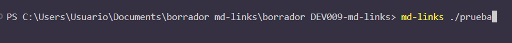

Esto te exhibirá todos los enlaces identificados en el archivo o directorio especificado bajo los siguientes criterios:

 * **href** - Enlace 
 * **text** - Texto al que hace referencia el enlace
 * **file** - Ruta en la que el enlace fue encontrado

### Ejemplo:

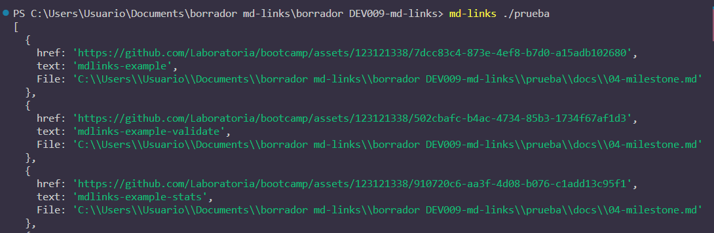


Esta librería cuenta con 3 alternativas para llevar a cabo su ejecución:

#### `1. --validate`

Validará si el enlace funciona correctamente o si está roto, añadiendo a cada enlace los siguientes parámetros:

- **status** - Códigos de respuesta HTTP
- **ok** - Éxito o fallo en la solicitud

### Ejemplo:

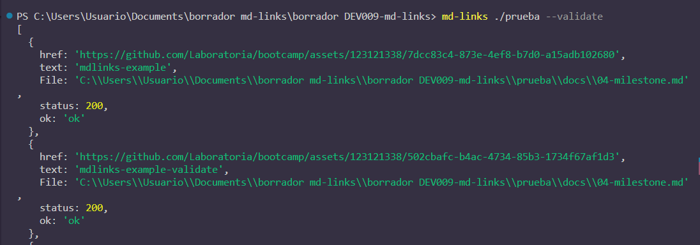
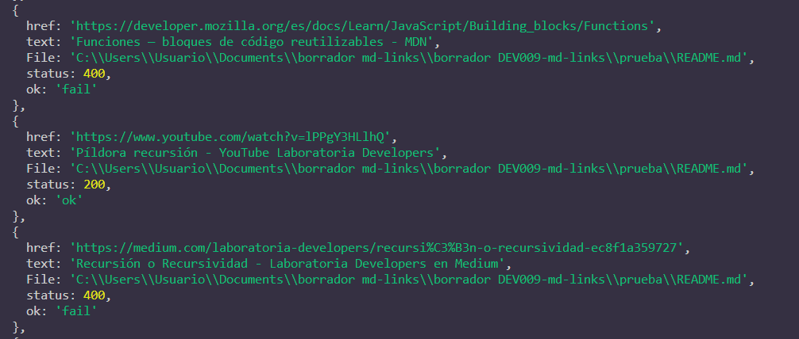


#### `2. --stats`

Mostrará estadísticas de los enlaces como:

- **Total** - Cantidad de enlaces encontrados
- **Únicos** - Cantidad de enlaces únicos, es decir, sin repeticiones.

### Ejemplo:

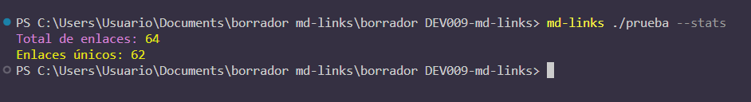


#### `3. --validate`  combinado con  `--stats`

Mostrará estadísticas de los enlaces que incluyen:

- **Total** - Cantidad total de enlaces encontrados.
- **Únicos** - Cantidad de enlaces únicos, es decir, sin repeticiones.
- **Rotos** - Cantidad de enlaces que se encuentran rotos.


### Ejemplo:

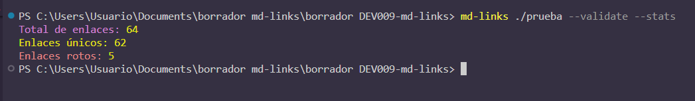

## Errores:

#### Cuando la ruta no es valida o no existe:

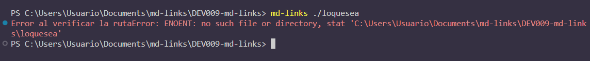

#### Cuando los comandos son erroneos:

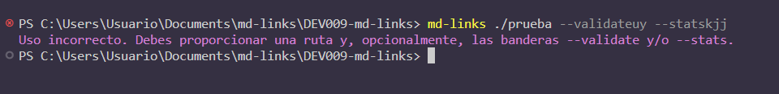

#### Cuando el archivo no es Markdown:

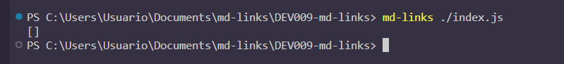

#### Cuando las carpetas no tienen archivos:

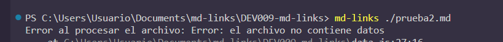

## 5. Implementación

### Diagrama de Flujo

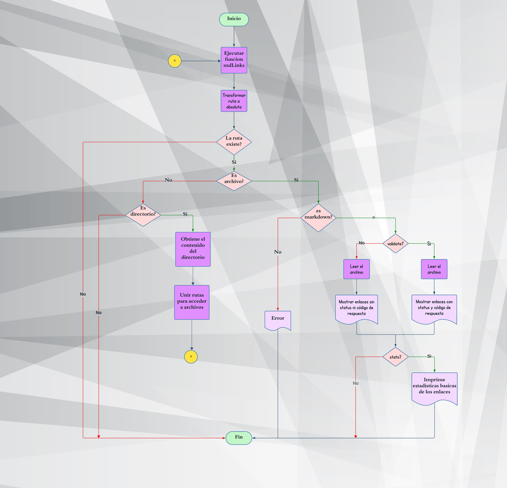

### Test Unitarios

*  Pasa tests y linters (`npm test`). Tests unitarios cubren un mínimo
  del 70% de coverage tests, es decir statements, functions, lines y branches.


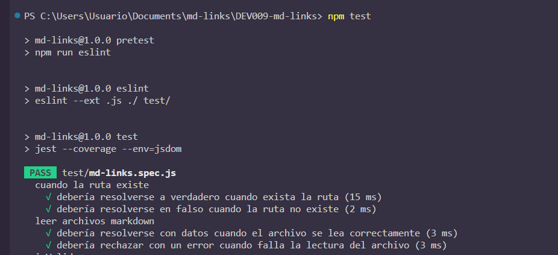
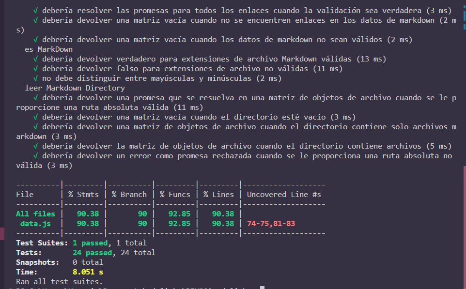


## 6. Planificación y Organización del Proyecto


Este proyecto está en proceso bajo una metodología ágil y utiliza los tableros de proyectos de GitHub para lograr una gestión eficaz y un seguimiento preciso del avance.

### Desarrollo del Proyecto

El proyecto se integro en 5 fases a las que organizamos en Hitos en Project GitHub.

Se empleó el tablero de proyectos de GitHub para administrar las actividades de forma estructurada; este tablero se encuentra dispuesto en múltiples columnas que reflejan distintas fases del proceso de desarrollo:


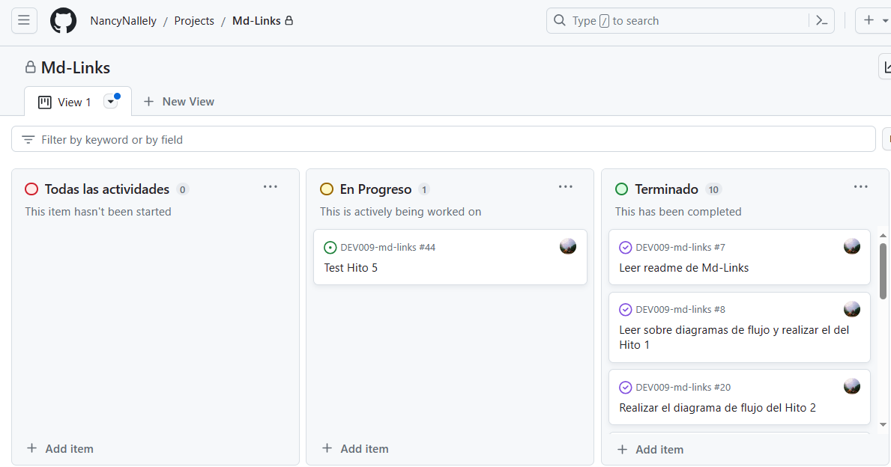

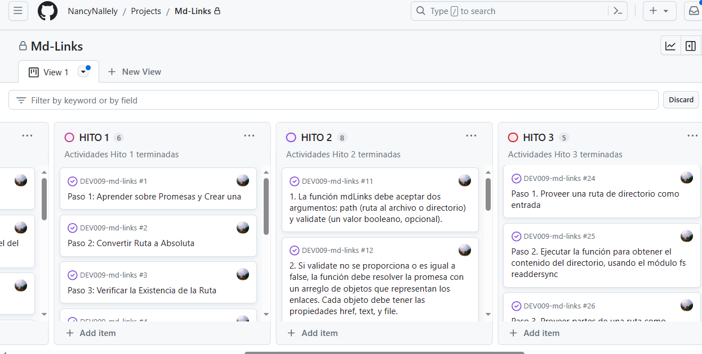

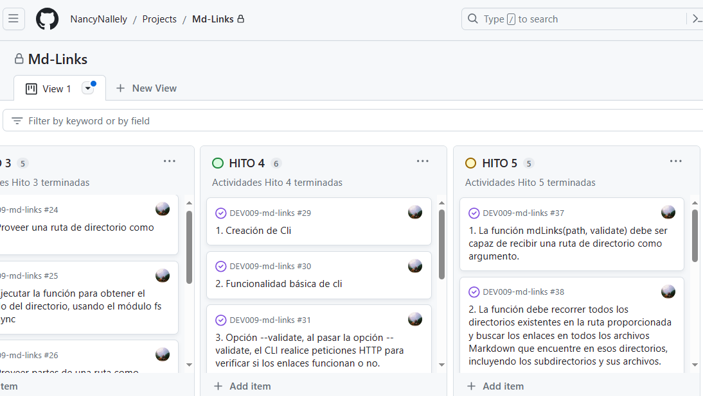

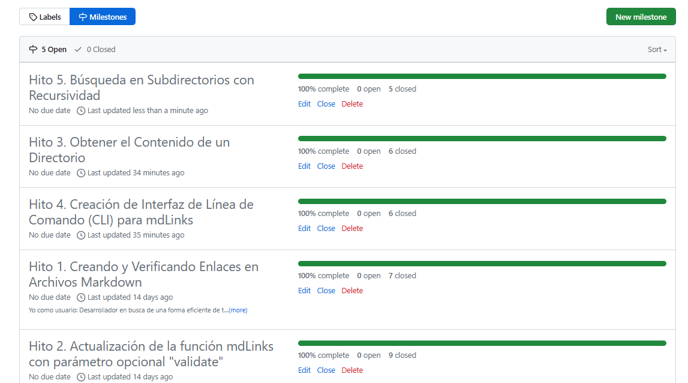


